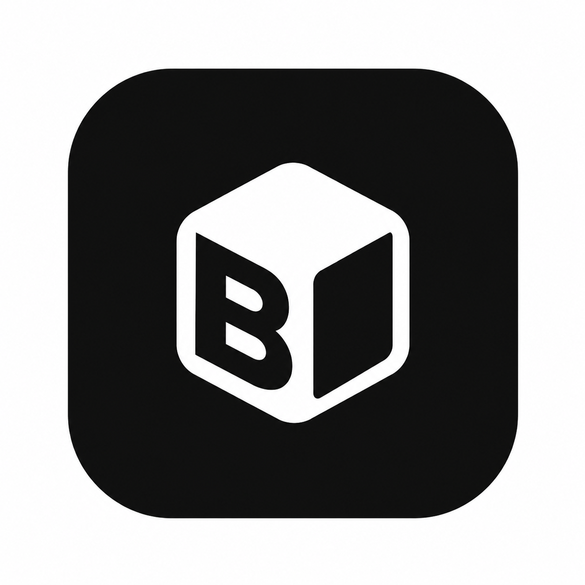

<p align="center">
  
</p>

# Bakchich

Sois payé pendant que tu codes.

Bakchich transforme la petite ligne de chargement des outils de code compatibles en emplacement sponsorisé discret, et reverse jusqu'à 50 % des revenus publicitaires au développeur dont la machine l'a affichée.

[Site](https://bakchich.dev) · [VS Code Marketplace](https://marketplace.visualstudio.com/items?itemName=bakchich.bakchich) · [Licence](LICENSE)

## L'idée

Quand un outil de code IA réfléchit, il affiche souvent un petit mot de chargement. C'est discret, visible, et aujourd'hui ça ne sert à rien.

Bakchich transforme cette ligne en mini-emplacement sponsorisé, propre et cliquable. Les annonceurs enchérissent dans une régie ouverte. Le développeur reçoit jusqu'à 50 % des revenus, crédités automatiquement à l'impression et au clic.

```diff
- * Percolating... (esc to interrupt)
+ * MONPPSPS : votre ppsps en moins de 5min https://api.bakchich.dev/c/demo (esc to interrupt)
```

Pas de sondage. Pas de crypto. Pas de vidéo à regarder. Tu continues à coder, et ton solde monte dans la barre de statut VS Code :

```text
Bakchich : 0,42 EUR aujourd'hui (7,11 EUR au total)
```

## Comment l'argent circule

Les annonceurs achètent des blocs. Un bloc correspond à 1 000 impressions de cinq secondes. Ils définissent un prix par bloc, un nom de marque, une phrase d'accroche, une URL de destination et, s'ils le souhaitent, une icône pour le site.

Une enchère ouverte décide quelle campagne passe en premier. Les bids les plus élevés sont prioritaires.

Jusqu'à 50 % du revenu publicitaire revient au développeur dont l'éditeur a affiché la pub. Un clic vaut 50 fois une impression.

Le solde en temps réel s'affiche dans la barre de statut VS Code. L'historique complet est disponible sur [bakchich.dev/me](https://bakchich.dev/me).

## Où la pub s'affiche

Bakchich se concentre aujourd'hui sur la ligne de chargement du terminal contrôlée par le fichier de réglages local. La pub est affichée en texte brut avec une URL de tracking visible, parce que c'est le format cliquable le plus fiable selon les terminaux.

```text
BRAND : short hook https://api.bakchich.dev/c/campaign-id?u=developer-id
```

Si l'environnement local compatible n'est pas détecté, Bakchich ne fait rien. L'éditeur et le terminal gardent leur comportement normal.

## Installation

1. Cherche **Bakchich** dans le VS Code Marketplace et installe l'extension.
2. Clique sur **Bakchich : Se connecter** dans la barre de statut.
3. Authentifie-toi avec Google.
4. Continue à coder. Les gains démarrent automatiquement quand une ligne compatible reste visible assez longtemps.

[Installer depuis le VS Code Marketplace](https://marketplace.visualstudio.com/items?itemName=bakchich.bakchich)

## Annoncer sur Bakchich

Tu achètes l'attention d'une audience très technique, dans le format le plus calme possible : une seule ligne pendant l'attente.

Utilise un nom de marque et une phrase d'accroche courte. L'icône reste affichée sur le site, mais pas dans le spinner.

```text
Nom : MONPPSPS
Accroche : votre ppsps en moins de 5min
Spinner : MONPPSPS : votre ppsps en moins de 5min + lien cliquable
```

[Acheter de l'inventaire sur bakchich.dev](https://bakchich.dev/annonceurs)

## Contenu du dépôt

Ce dépôt contient l'application Bakchich utilisée pour la transparence et le déploiement :

```text
extension/   Extension VS Code : injection spinner, tracking, solde, kill-switch
backend/     API Node/Express, ledger SQLite, enchères, OAuth, retraits
web/         Site React, tableau de bord développeur, portail annonceur
ops/         nginx, systemd, scripts de déploiement et provisioning
legal/       CGU, confidentialité, CGV annonceurs, mentions légales
docs/        Notes d'installation et de production
```

## Build local

```bash
cd extension
npm install
npm run build
npm test
npx vsce package --no-dependencies
```

```bash
cd backend
npm install
npm test
npm run seed
npm run dev
```

```bash
cd web
npm install
npm run build
```

## Licence

Propriétaire et source-available, pas open source. Copyright 2026 Bakchich. Tous droits réservés.

Tu peux lire et auditer ce code. Tu ne peux pas l'utiliser, le copier, le modifier, le distribuer, le commercialiser ou l'exécuter pour un autre service sans autorisation écrite. Voir [LICENSE](LICENSE).

Demandes commerciales : [privacy@bakchich.dev](mailto:privacy@bakchich.dev).

Fait avec beaucoup de café. Jusqu'à la moitié du revenu publicitaire est pour toi.
