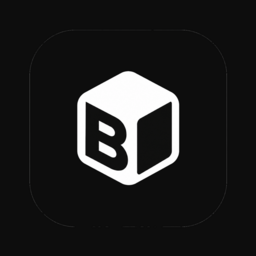

<p align="center">
  
</p>

# Bakchich

Sois payé pendant que tu codes.

Bakchich transforme la petite ligne de chargement des outils de code compatibles en emplacement sponsorisé discret, et reverse jusqu'à 50 % des revenus publicitaires au développeur dont la machine l'a affichée.

[Site](https://bakchich.dev) · [Tableau de bord](https://bakchich.dev/me) · [Annonceurs](https://bakchich.dev/annonceurs)

## L'idée

Quand un outil de code IA réfléchit, il affiche souvent un petit mot de chargement. Bakchich transforme cette ligne en mini-emplacement sponsorisé, propre et cliquable.

```diff
- * Percolating... (esc to interrupt)
+ * MONPPSPS : votre ppsps en moins de 5min https://api.bakchich.dev/c/demo (esc to interrupt)
```

Les annonceurs enchérissent dans une régie ouverte. Tu reçois jusqu'à 50 % des revenus, crédités automatiquement à l'impression et au clic.

Ton solde s'affiche directement dans la barre de statut VS Code :

```text
Bakchich : 0,42 EUR aujourd'hui (7,11 EUR au total)
```

## Fonctionnalités

- Gains passifs quand une ligne compatible reste visible assez longtemps.
- Jusqu'à 50 % de partage de revenus sur les impressions et les clics.
- Un clic vaut 50 fois une impression.
- Opt-in strict : rien n'est injecté tant que tu n'es pas connecté.
- Réversible : pause, déconnexion ou restauration depuis le menu de la barre de statut.
- Confidentialité : aucun code, prompt, fichier, sortie terminale ou contenu de conversation n'est lu.

## Installation

1. Installe **Bakchich** depuis le VS Code Marketplace.
2. Clique sur **Bakchich : Se connecter** dans la barre de statut.
3. Authentifie-toi avec Google.
4. Continue à coder. Les gains démarrent automatiquement quand une ligne compatible reste visible assez longtemps.

## Barre de statut

| État | Signification |
| --- | --- |
| `Bakchich : Se connecter` | Pas encore connecté. Clique pour t'authentifier. |
| `Bakchich : 0,42 EUR aujourd'hui (7,11 EUR au total)` | Connecté et en train de gagner. |
| `Bakchich en pause` | Pause temporaire. Clique pour reprendre. |
| `Bakchich suspendu` | Kill-switch serveur actif. |
| `Bakchich hors-ligne` | Backend temporairement injoignable. L'extension réessaie automatiquement. |
| `Bakchich incompatible` | Les réglages locaux nécessaires n'ont pas été détectés. |

Clique sur la barre de statut pour ouvrir le menu Bakchich : connexion, déconnexion, pause, restauration, diagnostic ou tableau de bord.

## Confidentialité

Bakchich communique uniquement avec le backend Bakchich sur `api.bakchich.dev`.

L'extension envoie :

- Un identifiant d'appareil anonyme.
- Les événements d'impression et de clic.
- Ton email Google après connexion, utilisé pour créditer ton compte.

Elle ne lit pas ton code, tes prompts, tes fichiers, tes sorties terminal, ni le contenu de tes conversations.

## Commandes

| Commande | Description |
| --- | --- |
| Bakchich : Se connecter | S'authentifier avec Google. |
| Bakchich : Se déconnecter | Arrêter les gains et restaurer le spinner d'origine. |
| Bakchich : Menu | Ouvrir le menu complet. |
| Bakchich : Activer / Désactiver | Mettre en pause ou reprendre. |
| Bakchich : Restaurer | Restaurer le texte d'origine du spinner. |
| Bakchich : Diagnostic | Vérifier la connexion et l'état local. |
| Bakchich : Tableau de bord | Ouvrir bakchich.dev/me. |

## Réglages

| ID | Description | Défaut |
| --- | --- | --- |
| `bakchich.apiUrl` | URL de l'API Bakchich. | `https://api.bakchich.dev` |
| `bakchich.viewThresholdSeconds` | Temps visible requis avant de créditer une impression. | `5` |

## Annoncer sur Bakchich

Utilise un nom de marque et une phrase d'accroche courte. L'icône reste affichée sur le site, mais pas dans le spinner.

```text
Nom : MONPPSPS
Accroche : votre ppsps en moins de 5min
Spinner : MONPPSPS : votre ppsps en moins de 5min + lien cliquable
```

[Acheter de l'inventaire sur bakchich.dev](https://bakchich.dev/annonceurs)

## Licence

Propriétaire et source-available, pas open source. Tu peux lire et auditer ce code, mais tu ne peux pas l'utiliser, le copier, le modifier, le distribuer, le commercialiser ou l'exécuter pour un autre service sans autorisation écrite.

Voir `LICENSE`.
